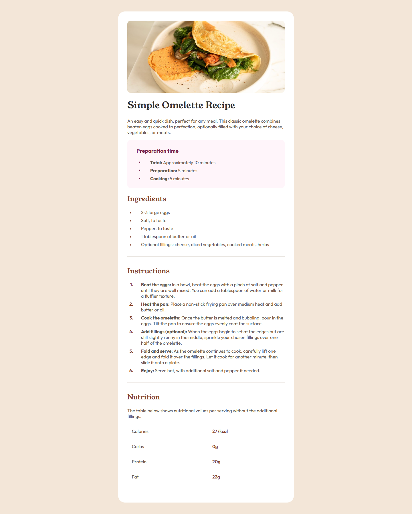
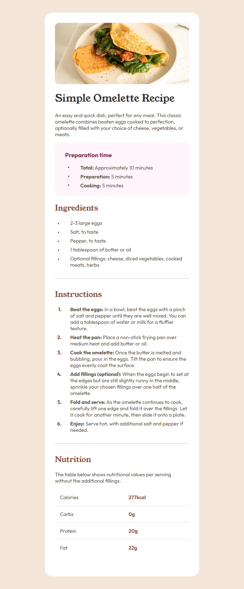
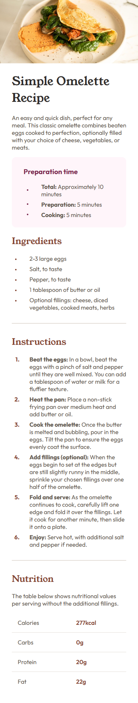

# Frontend Mentor - Recipe Page Solution

This is a solution to the [Recipe page challenge on Frontend Mentor](https://www.frontendmentor.io/challenges/recipe-page-KiTsR8QQKm).

## Overview

### Screenshots

#### Desktop

#### Tablet

#### Mobile

### Links

- Live Site URL: [https://jflsk.github.io/Recipe-Page/](https://jflsk.github.io/Recipe-Page/)

### Build With

- SCSS
- Mobile-first workflow

### Author

- Frontend Mentor - [@jflsk](https://www.frontendmentor.io/profile/jflsk)
